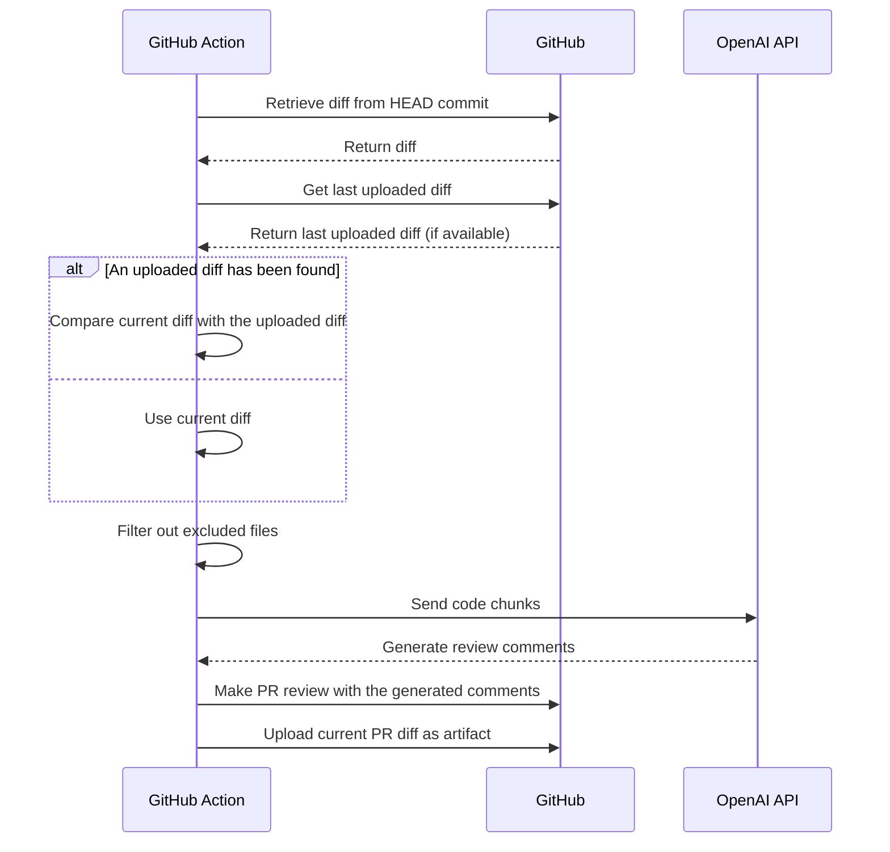

# AI Code Reviewer

AI Code Reviewer is a GitHub Action that leverages OpenAI's GPT-4 API to provide intelligent feedback and suggestions on
your pull requests. This powerful tool helps improve code quality and saves developers time by automating the code
review process.

## Features

- Reviews pull requests using OpenAI's GPT-4 API.
- Provides intelligent comments and suggestions for improving your code.
- Filters out files that match specified exclude patterns.
- Easy to set up and integrate into your GitHub workflow.

## Setup

1. To use this GitHub Action, you need an OpenAI API key. If you don't have one, sign up for an API key
   at [OpenAI](https://beta.openai.com/signup).

2. Add the OpenAI API key as a GitHub Secret in your repository with the name `OPENAI_API_KEY`. You can find more
   information about GitHub Secrets [here](https://docs.github.com/en/actions/reference/encrypted-secrets).

3. Create a `.github/workflows/main.yml` file in your repository and add the following content:

```yaml
name: AI Code Reviewer

on:
  pull_request:
    types:
      - opened
      - synchronize
permissions: write-all
jobs:
  review:
    runs-on: ubuntu-latest
    steps:
      - name: Checkout Repo
        uses: actions/checkout@v3

      - name: AI Code Reviewer
        uses: your-username/ai-code-reviewer@main
        with:
          GITHUB_TOKEN: ${{ secrets.GITHUB_TOKEN }} # The GITHUB_TOKEN is there by default so you just need to keep it like it is and not necessarily need to add it as secret as it will throw an error. [More Details](https://docs.github.com/en/actions/security-guides/automatic-token-authentication#about-the-github_token-secret)
          OPENAI_API_KEY: ${{ secrets.OPENAI_API_KEY }}
          OPENAI_API_MODEL: "gpt-4o" # Optional: defaults to "gpt-4o"
          exclude: "**/*.json, **/*.md" # Optional: exclude patterns separated by commas
          debug: "true" # Optional: print extra logs during execution
```

4. Replace `your-username` with your GitHub username or organization name where the AI Code Reviewer repository is
   located.

5. Customize the `exclude` input if you want to ignore certain file patterns from being reviewed.

6. Remove the `debug` input if you don't want extra debugging logs

7. Commit the changes to your repository, and AI Code Reviewer will start working on your future pull requests.

## How It Works

The AI Code Reviewer GitHub Action retrieves the pull request diff, filters out excluded files, and sends code chunks to
the OpenAI API. It then generates review comments based on the AI's response and adds them to the pull request.

The diff to be reviewed is calculated by comparing the diff from the head commit with the diff from the previous commit,
which is uploaded as a Github Actions artifact at the end of the action. This strategy is used to be able to identify
the accurate diff between pushes, even if the branch history has changed with a rebase or amend via force-push and the
previous commit no longer exists.



## Contributing

Contributions are welcome! Please feel free to submit issues or pull requests to improve the AI Code Reviewer GitHub
Action.

Let the maintainer generate the final package (`yarn build` & `yarn package`).

## License

This project is licensed under the MIT License. See the [LICENSE](LICENSE) file for more information.
